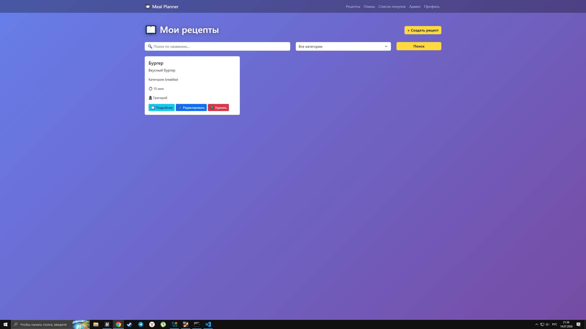
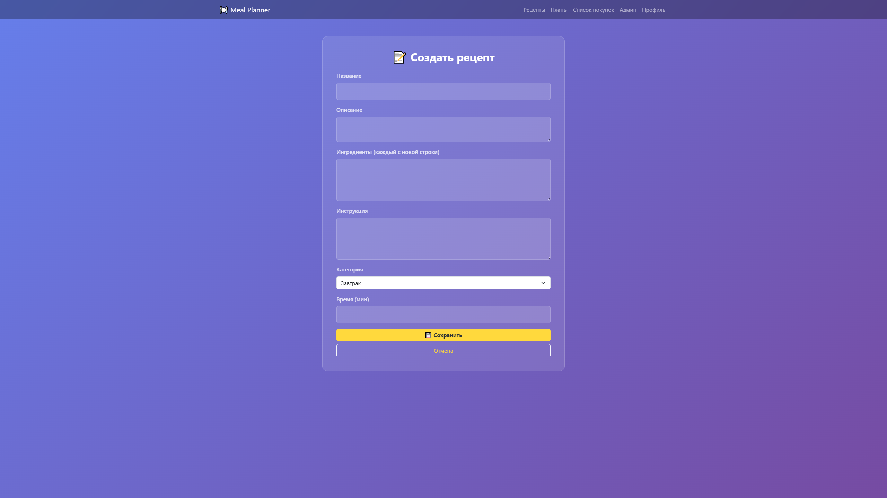
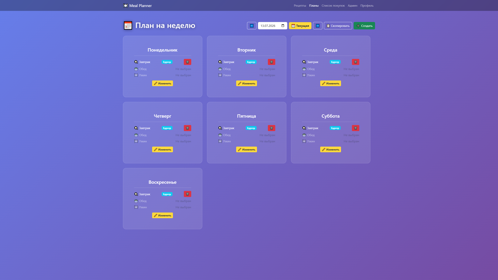
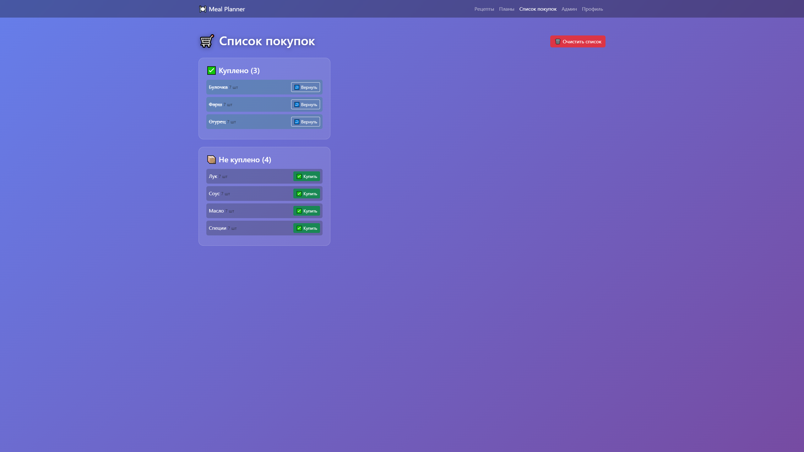

# 🍽️ Meal Planner

**Веб-приложение для планирования питания на неделю с автоматическим списком покупок.**

Это полноценный сервис, где пользователи могут создавать рецепты, планировать меню на неделю и автоматически формировать список покупок. Проект разработан на FastAPI с использованием Docker и Nginx.

---

## 📸 Скриншоты

### Главная страница


### Рецепты


### Создание рецепта


### План на неделю


### Список покупок


---

## 🚀 Функционал

### 👤 Пользователи
- Регистрация и вход (JWT)
- Обновление профиля (имя, email, пароль)
- Администратор может блокировать/разблокировать пользователей

### 📚 Рецепты
- Создание, просмотр, редактирование и удаление
- Фильтрация по категории
- Поиск по названию
- Пагинация

### 📅 Планирование
- Создание плана на неделю (завтрак, обед, ужин)
- Выбор рецептов на каждый день
- Копирование плана на следующую неделю
- Редактирование и удаление

### 🛒 Список покупок
- Автоматическая генерация из плана
- Отметка продуктов как купленных
- Очистка списка

### 🛡️ Админ-панель
- Управление пользователями (блокировка/разблокировка)
- Удаление любых рецептов

---

## 🛠️ Технологии

### Бэкенд
- Python 3.12
- FastAPI
- SQLAlchemy 2.0 (async)
- PostgreSQL
- JWT (Access + Refresh Tokens)
- Alembic (миграции)

### Фронтенд
- HTML5, CSS3, JavaScript
- Bootstrap 5
- Animate.css
- Glassmorphism

### Инфраструктура
- Docker + Docker Compose
- Nginx (reverse proxy)

---

## 📁 Структура проекта

```bash

meal_planner/
├── backend/               # FastAPI
│   ├── app/
│   │   ├── routers/       # Эндпоинты
│   │   ├── models.py      # SQLAlchemy модели
│   │   ├── schemas.py     # Pydantic схемы
│   │   └── auth.py        # JWT, bcrypt
│   └── Dockerfile
├── frontend/              # HTML, CSS, JS
│   ├── css/
│   ├── js/
│   └── *.html
├── nginx/
│   └── default.conf       # Конфиг Nginx
└── docker-compose.yml

---

```

### ⭐ Если тебе понравился проект — поставь звёздочку на GitHub!